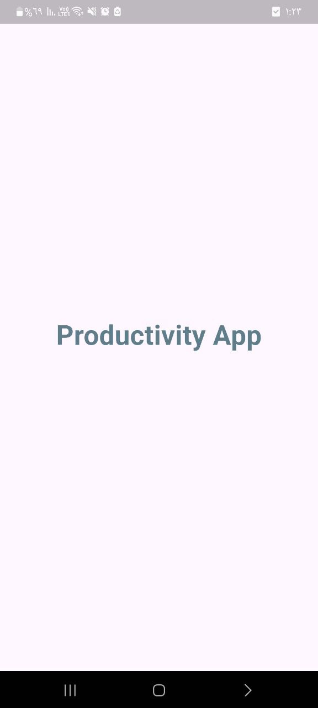
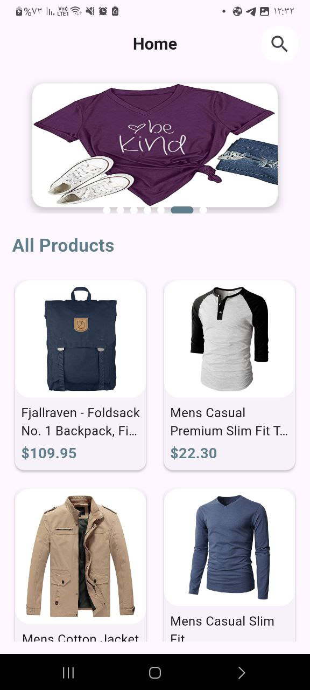
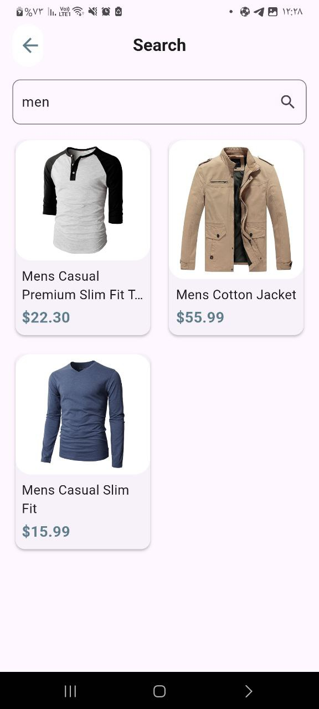
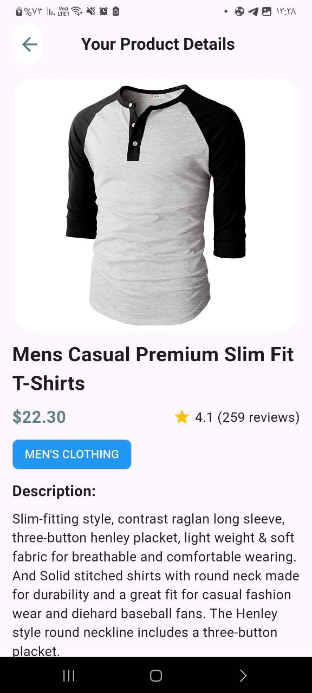

# Flutter Interview App

This is a Flutter-based application designed to demonstrate the implementation of routing, state management using `flutter_bloc`, and API integration using `dio`. The app includes a splash screen and a home screen that fetches and displays product data.

## Features

- **Splash Screen**: Initial screen displayed when the app launches.
- **Home Screen**: Displays a list of products fetched from an API.
- **State Management**: Uses `flutter_bloc` for managing application state.
- **API Integration**: Uses `dio` for making HTTP requests.
- **Responsive UI**: Ensures the app works seamlessly across different screen sizes using `flutter_screenutil`.

## Project Structure

- **Core**: Contains reusable components like API consumers.
- **Features**: Organized by app features (e.g., `home`, `splash`).
- **Routers**: Centralized routing configuration using `go_router`.

## Screenshots

### Splash Screen


### Home Screen

### Search Screen

### Product Details Screen


## Getting Started

### Prerequisites

- Flutter SDK installed on your machine.
- A code editor like Visual Studio Code or Android Studio.
- Internet connection for fetching dependencies.

### Installation

1. Clone the repository:
   ```bash
   git clone <repository-url>
   ```
2. Navigate to the project directory:
   ```bash
   cd interview
   ```
3. Install dependencies:
   ```bash
   flutter pub get
   ```

### Running the App

1. Run the app on an emulator or a physical device:
   ```bash
   flutter run
   ```

## Key Files

- **`lib/main.dart`**: Entry point of the application.
- **`lib/routers.dart`**: Defines the app's navigation routes.
- **`lib/features/home`**: Contains the home screen's logic and UI.
- **`lib/features/splash`**: Contains the splash screen's UI.

## Dependencies

- `flutter_bloc`: State management.
- `go_router`: Navigation and routing.
- `dio`: HTTP client for API calls.
- `flutter_screenutil`: Responsive UI design.

## Contributing

Contributions are welcome! Please fork the repository and submit a pull request with your changes.

## License

This project is licensed under the MIT License. See the LICENSE file for details.